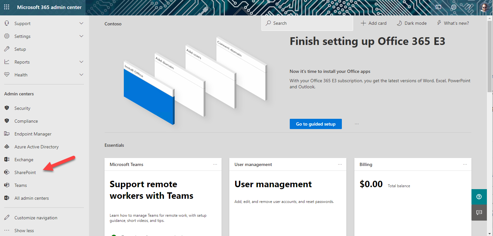
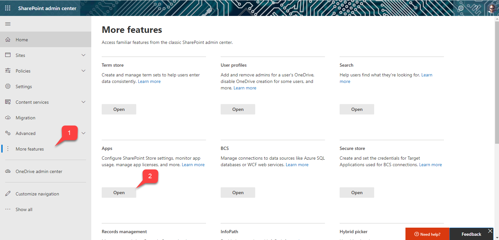

# Part 1: Lab Setup

 * [Part 1: Lab setup](Documents/Part1.md) <-- this section
 * [Part 2: SharePoint News](Documents/Part2.md)
 * [Part 3: SharePoint List Tab](Documents/Part3.md)
 * [Part 4: SharePoint Framework tabs](Documents/Part4.md)
 * [Part 5: Calling the Microsoft Graph](Documents/Part5.md)
 * [Resources](Documents/Resources.md)

In this section, you'll set up your tenant for SharePoint and Teams development.

## Step 1: Get a tenant

If you don't yet have a tenant, ask the workshop leader or join the [Microsoft 365 Developer Program](https://developer.microsoft.com/microsoft-365/dev-program?WT.mc_id=M365-github-rogerman) to get a free one. Your tenant includes 25 [E5 user licenses](https://www.microsoft.com/microsoft-365/enterprise/compare-office-365-plans?WT.mc_id=M365-github-rogerman) and can be renewed as long as you keep developing!

Go to the [Microsoft 365 admin center](https://portal.office.com/AdminPortal/Home#/homepage) and log in as an administrator of your new tenant.

## Step 2: Enable Teams application uploads

By default, end users can't upload Teams applications directly; instead an administrator needs to upload them into the enterprise app catalog. In this step you will enable direct uploads to make developement easier and allow installation directly from [App Studio](https://docs.microsoft.com/microsoftteams/platform/concepts/build-and-test/app-studio-overview?WT.mc_id=M365-github-rogerman) or the [Microsoft Teams Toolkit for Visual Studio Code](https://docs.microsoft.com/microsoftteams/platform/toolkit/visual-studio-code-overview?WT.mc_id=M365-github-rogerman).

  a. In the left panel of the admin center, click "Show all" to open up the entire navigation

  

  When the panel opens, click Teams to open the Microsoft Teams admin center.

  

  b. In the left of the Microsoft Teams admin center, open the Teams apps accordion (1) and select Setup Policies (2). You will see a list of App setup policies. Click the Global (Org-wide default) policy (3).

  

 c. Ensure the first switch, "Upload custom apps" is turned On.

 

 This can take up to 24 hours to take effect, but usually it's much faster. With any luck, by the time you need it, it will be enabled. Instructions for completing the labs without "Upload custom apps" are included, but it will be easier if it's turned on.

## Step 3: Create the SharePoint app catalog

This one can take up to 20 minutes to take effect, so again we want to get it done right away.

 a. Return to the Microsoft 365 admin center; this time click "SharePoint" to go to the SharePoint admin center.

 

 b. In the SharePoint admin center, click "More Features" (1) and then open the Apps page (2).

 

 c. In the Apps screen, click App Catalog

 

 Click OK to create a new app catalog site.

 

 On the Create App Catalog Site Collection screen,

  * (1) Set the title to "Catalog"
  * (2) Don't change the host name or managed path of the Web Site address, but do complete the address with "catalog"
  * (3) Make yourself the administrator of the app catalog by typing "Admin" and click the small person icon
  * (4) Server resource quota is obsolete; you can leave it or set it to zero

  Click OK to create the app catalog.

 

 d. You will be brought to the Classic sites view. You should see the app catalog site collection with a spinning green icon to indicate it's in the process of being created. When the green icon becomes the word "New", the app catalog site has been created.

 NOTE: The app catalog still won't work right away; you'll get errors if you try to upload an app right now. You might want to note the time; it can take up to 20 minutes. Meanwhile, you can proceed to the next part of the exercise; Part 2 does not require either the Teams upload or the SharePoint app catalog.

 [Next section is here](Documents/Part2.md)