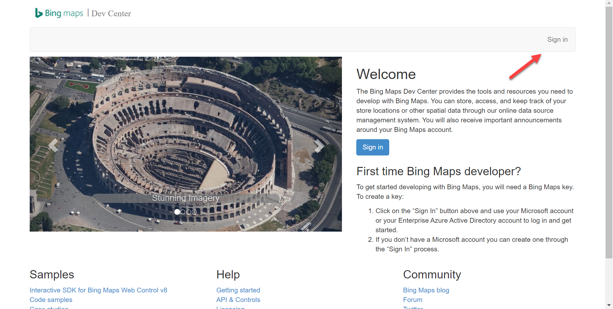
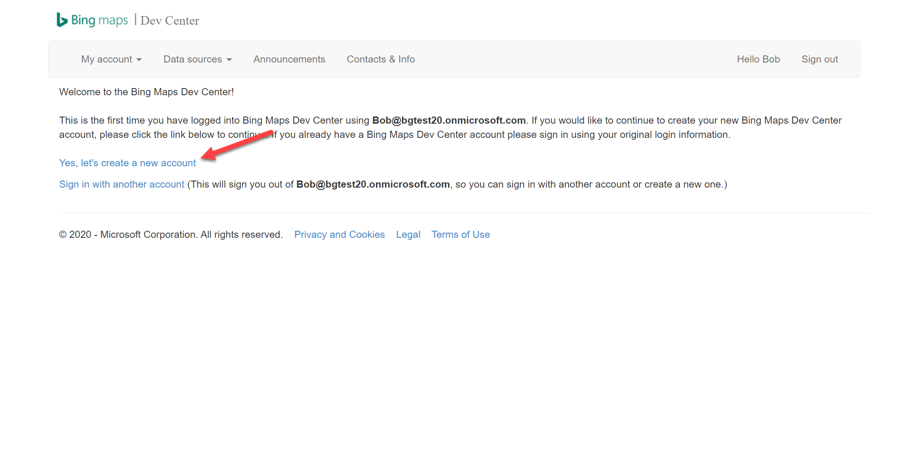
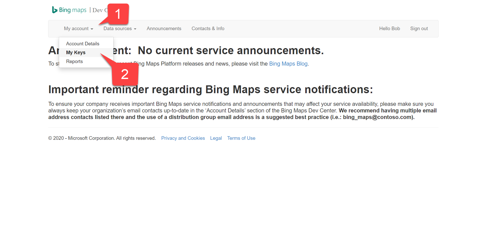
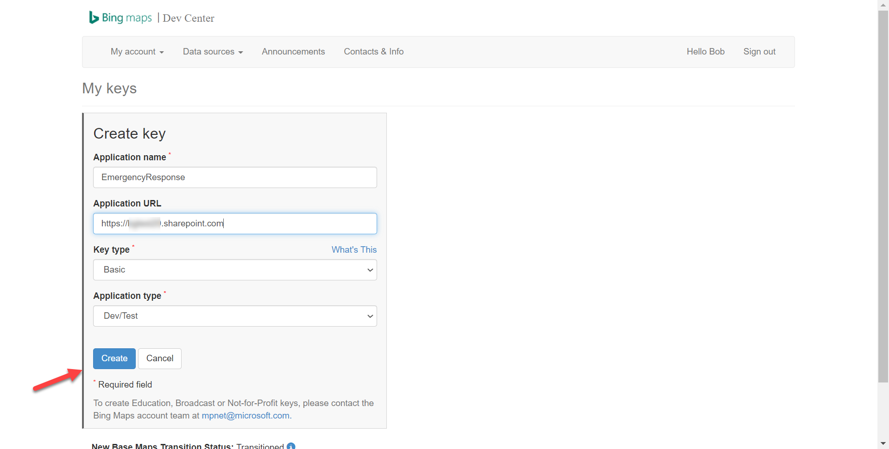
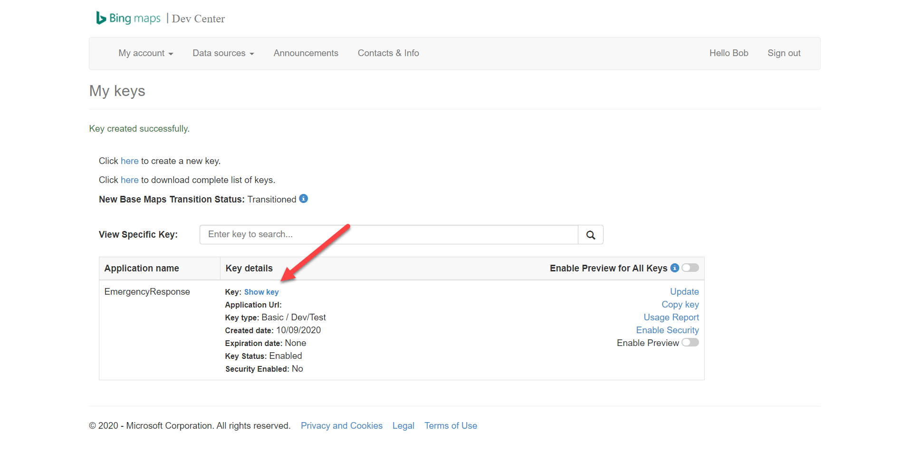
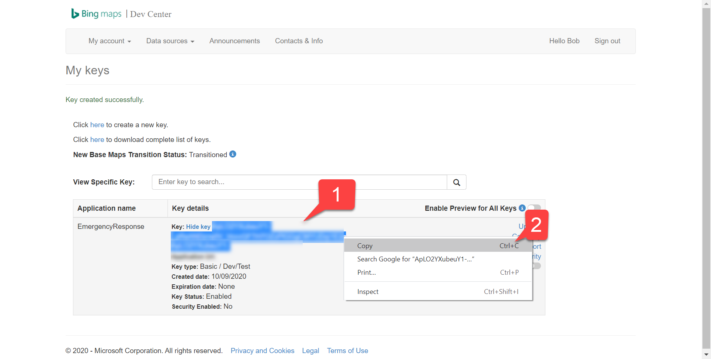

# Bing Maps Signup

To sign up for a Bing maps key, follow these steps:

First, browse to the [Bing Maps developer center]() and select **Sign in**. You can sign in with your new Microsoft 365 developer login if you wish!

Once you're logged in, select **Yes, let's create a new account**.

Fill in the **Create account** form and select **Create** to create your Bing Maps developer account.

Under the **My account** menu 1️⃣, select **My keys** 2️⃣.

Fill in the **Create key** dialog box with a URL for your SharePoint root site in the **Application URL** field. For example, if your tenant is `contoso.onmicrosoft.com`, enter `https://contoso.sharepoint.com/`.

In the **My keys** screen, select **Show key** to show your new key.

Select the key 1️⃣ (it may span 2 or 3 lines) and copy it to your clipboard 2️⃣.  Save it somewhere safe; you'll need it in exercise 4.

