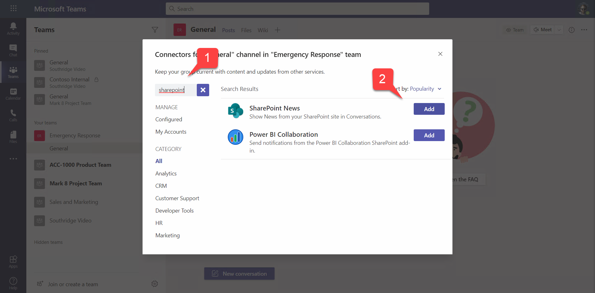
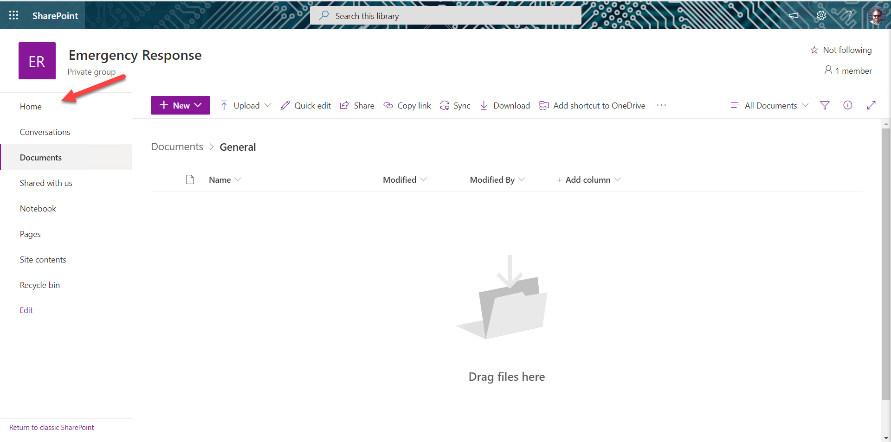
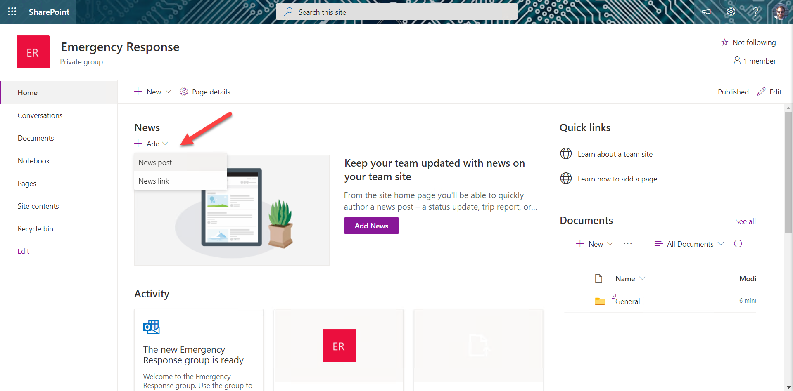
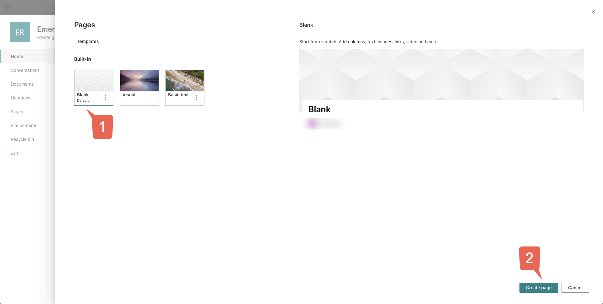
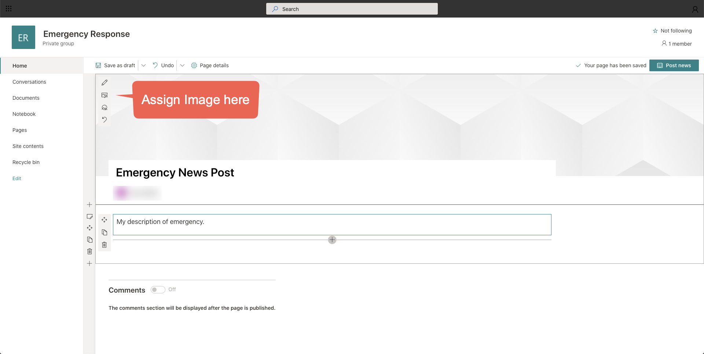
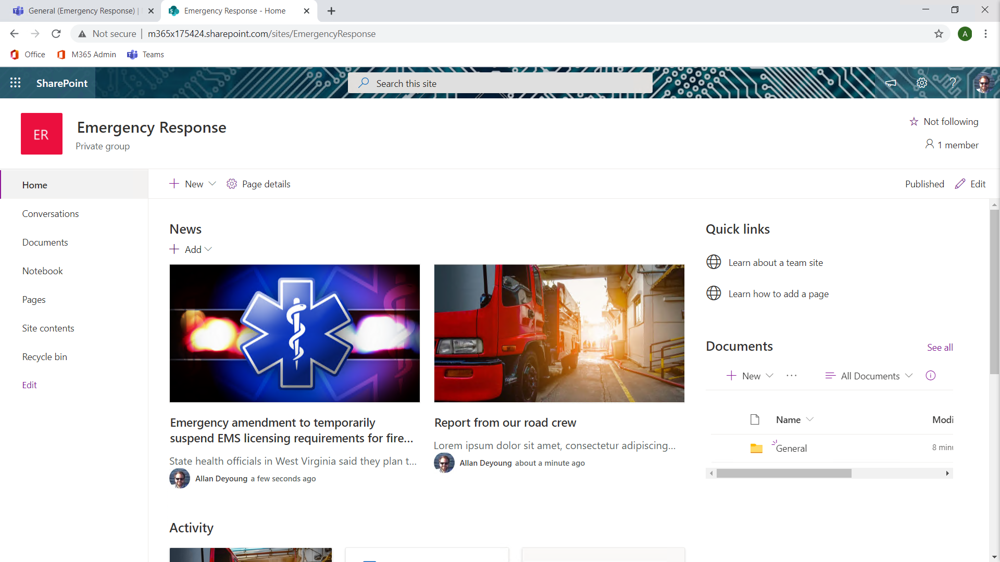
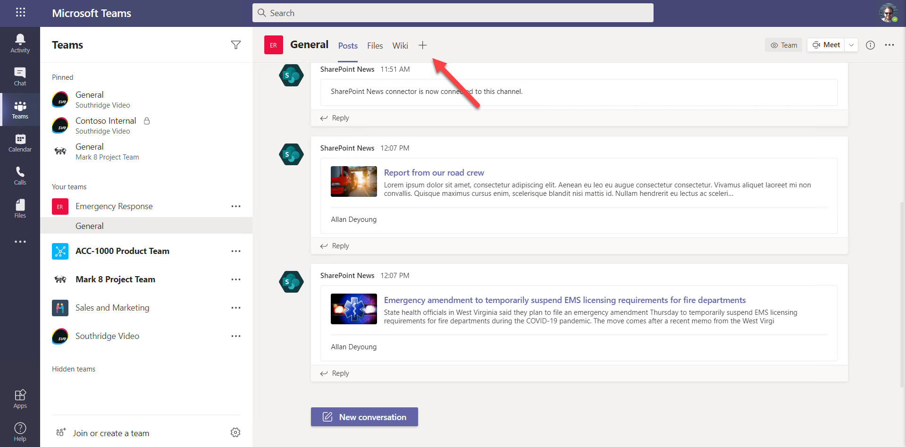
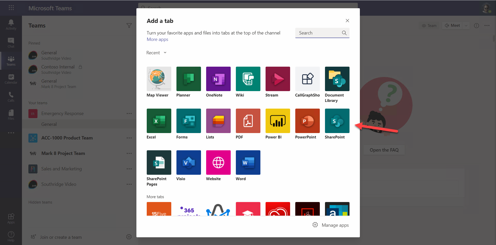
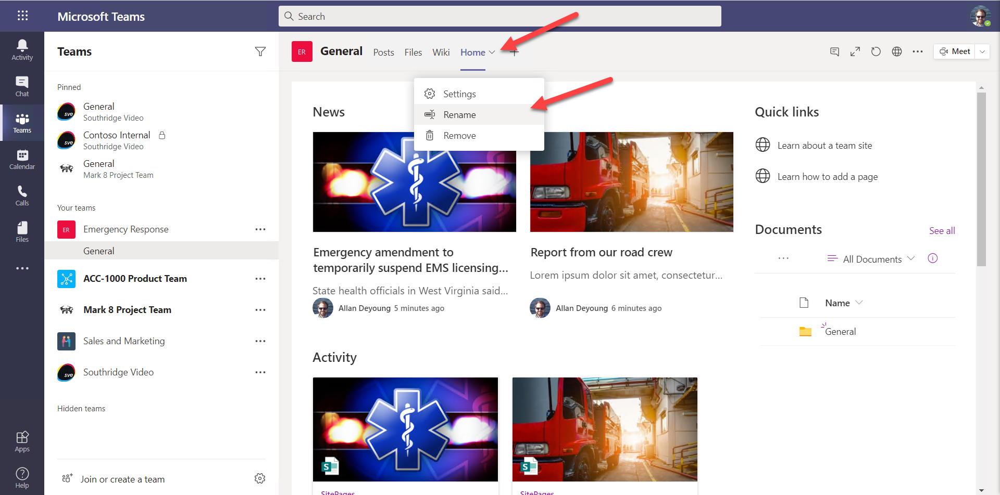
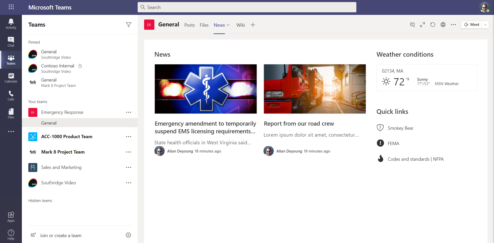

# Exercise 2: SharePoint News

 * [Presentation](../Presentation.md)
 * [Exercise 1: Lab setup](Part1.md)
 * [Exercise 2: SharePoint News](Part2.md) **(You are here)**
 * [Exercise 3: SharePoint List Tab](Part3.md)
 * [Exercise 4: SharePoint Framework tabs](Part4.md)
 * [Exercise 5: Calling the Microsoft Graph](Part5.md)
 * [Resources](Resources.md)

In this exercise, you will create a news site in SharePoint and connect it to the Emergency Response team you set up in [Exercise 1](Part1.md). This exercise is optional - the remaining parts do not depend on it - so you could choose to skip it or come back to it later, and proceed directly to [Exercise 3](Part3.md)

## Step 1: Add the SharePoint connector

Begin in the Emergency Response Team you created in the previous exercise.

a. To the right of the General channel, click the elipsis 1️⃣ to open the context menu, and select Connectors 2️⃣.

b. Find the SharePoint News connector; you may need to search 1️⃣. Click Add 2️⃣ to add the connector.

c. Click Add in the screen which follows, and then Save in the screen after that to save the connector.

---
⛏️ WHY TWO SCREENS WHEN ADDING THE CONNECTOR? The first screen was from Microsoft Teams to make sure you're installing the right connector. The second screen with the Save button was a configuration screen provided by the Teams application. The SharePoint News connector didn't require any configuration, but you could build a connector that is configurable, allowing the user to decide what information they want sent.)

---

## Step 2: Add some news to the SharePoint site

a. Still in the General channel, click the elipsis in the upper right corner 1️⃣ to open the menu and select "Open in SharePoint" 2️⃣. 

b. This will bring you into the SharePoint site that's associated with this Team, viewing the file folder for the channel. You may need to log in if this is the first time opening SharePoint in your new tenant. Navigate to the Home page.

c. On the home page under News, click Add. Add one News Post and one News Link.

If you're not sure what page template to use, just select the Blank one 1️⃣ and then click "Create page"2️⃣.

You can set the heading image by clicking on the image icon to the left of the gray banner. 

Search for a stock image that conveys an emergency. Notice that you can move the image around by dragging the circle in the middle. Add some text and click "Post news" to publish your news article.

Now create a News Link; search the Internet for a news story about an emergency and paste the URL. In the end, your home page should show both news items front and center.

---
⛏️ DO MORE WITH  SHAREPOINT NEWS: This exercise is only the beginning. News stories can appear in SharePoint hub sites, the SharePoint mobile app, in personalized news feeds, and more! [This article](https://support.microsoft.com/office/create-and-share-news-on-your-sharepoint-sites-495f8f1a-3bef-4045-b33a-55e5abe7aed7?WT.mc_id=M365-github-rogerman) has the details.

---

## Step 3: Add a News tab to the General channel

a. Return to the General channel in Microsoft Teams. To the right of the tabs, click "+" to add a tab to the channel.

b. Find the SharePoint tab and add it to the channel.

c. Be sure you select the default SharePoint site 1️⃣ and click the Home page 2️⃣ to select it. Click Save 3️⃣ and view your news page. Your page may look a little different than the screen shot; just make sure you choose the Home page and not one of the individual news stories.

d. Rename the tab to "News" and drag it to the left of the wiki tab.

##

---
🏁 CHALLENGE: Add more information to the site home page such as useful links, upcoming safety drills and preparedness events, policies and procedures, etc.

---

When you're ready, please [proceed to the next section.](Part3.md)
