# Part 3: SharePoint List Tab

 * [Exercise 1: Lab setup](Part1.md)
 * [Exercise 2: SharePoint News](Part2.md)
 * [Exercise 3: SharePoint List Tab](Part3.md) **(You are here)**
 * [Exercise 4: SharePoint Framework tabs](Part4.md)
 * [Exercise 5: Calling the Microsoft Graph](Part5.md)
 * [Challenges: Ideas for going beyond the lab exercises](Challenges.md)
 * [Resources](Resources.md)

In this exercise you'll create a Teams application for managing inventory needs during an emergency. The app will be implemented as a SharePoint list, and published as a Teams tab.

## Step 1: Create the SharePoint list

a. In the General channel's Posts tab, click the elipsis in the upper right corner 1️⃣ and select "Open SharePoint" 2️⃣.

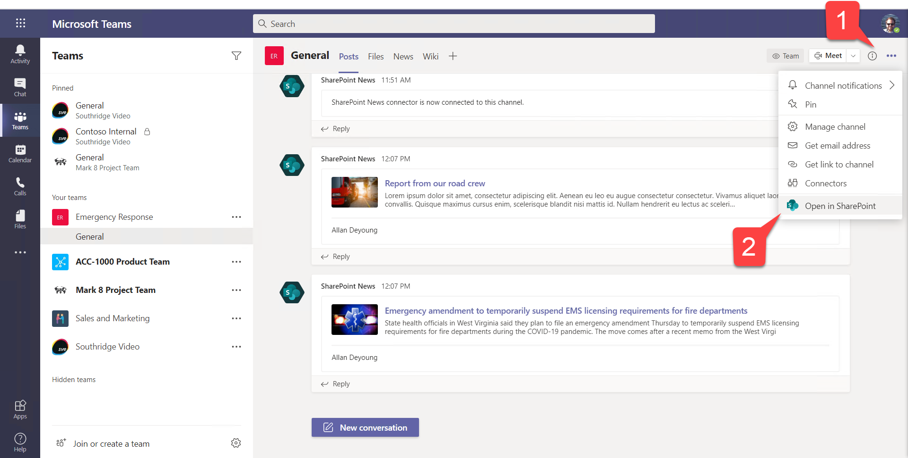

b. The SharePoint site should open in a new browser tab. In the left navigation, click "Site contents" 1️⃣. Click the drop-down on the New button 2️⃣ and select "List".

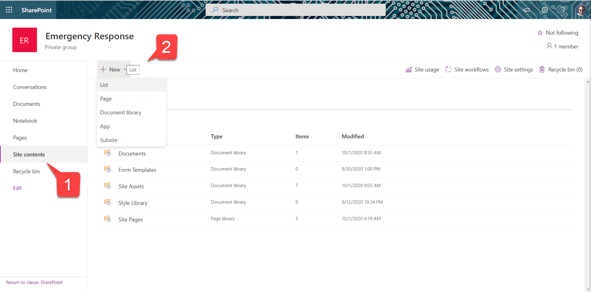

c. Name the list "Supplies Needed" 1️⃣ and then click the "Create" button 2️⃣.

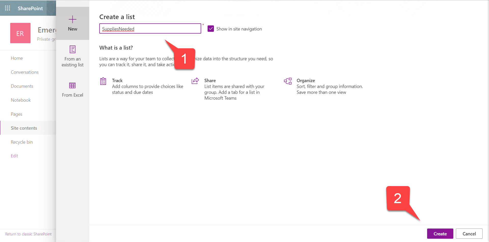

d. Click "Add Column" 1️⃣ and select a new "Location" column 2️⃣.

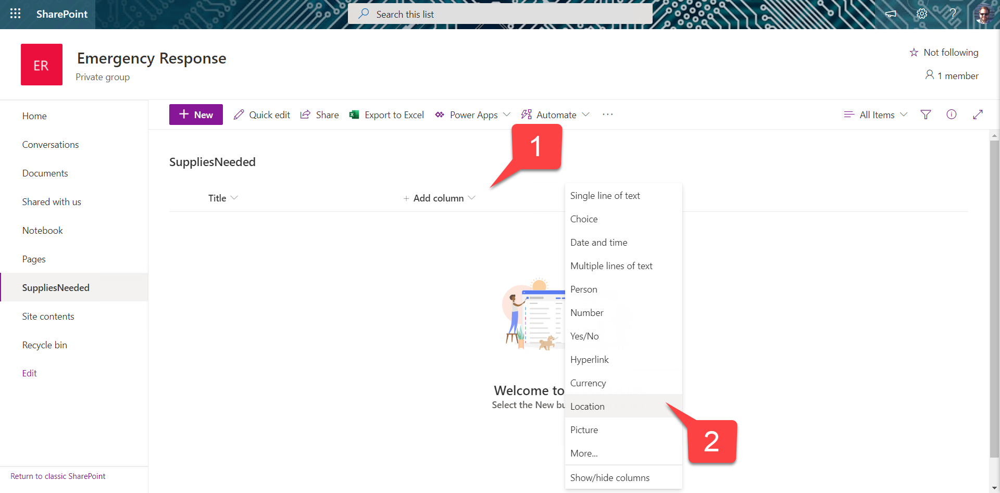

e. Name the column "Location" 1️⃣. Do not show any of the linked columns, just click "Save" 2️⃣.

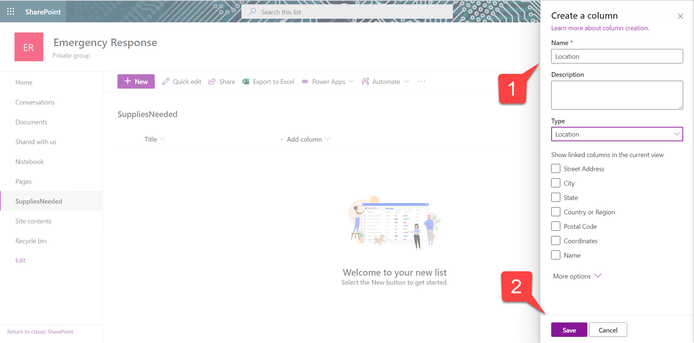

f. Click the down arrow to the right of the new column name 1️⃣ to open a menu and select "Format this column" 2️⃣.

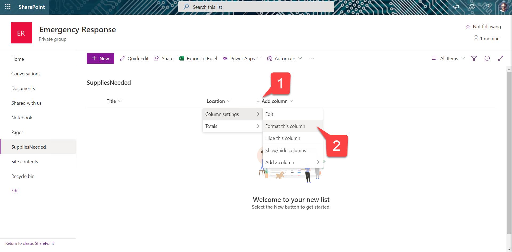

g. Under column formatting, paste in the JSON 1️⃣ from the [location.json](../Solution/Column%20samples/location.json) file in this project and click "Save" 2️⃣.

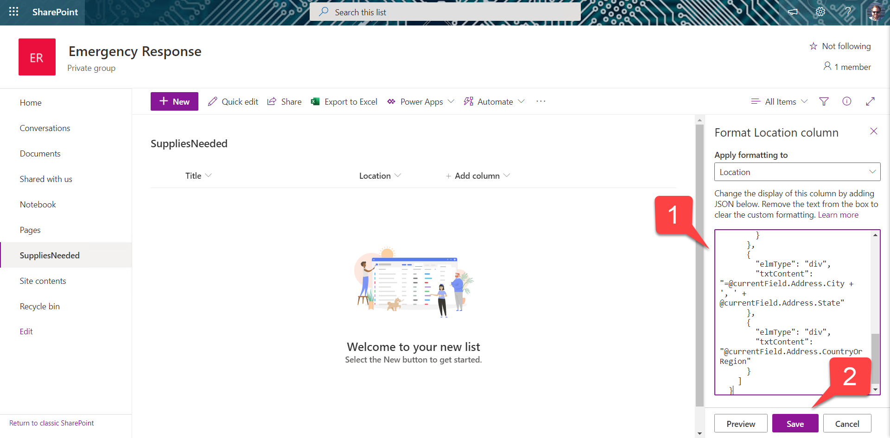

h. Repeat the process for additional columns as follows:

|---|---|---|
| Contact | People | [contact.json](../Solution/Column%20samples/contact.json) |
| Supplies | Choice of: Food, Water, Flashlight, Pet supplies,
Medicine (spelling and upper/lower case must match exactly for formatting to work) | [supplies.json](../Solution/Column%20samples/supplies.json) |
| Comments | Multi-line text | none |

Note that for some of the columns you'll need to click "Advanced mode" to get to the JSON.

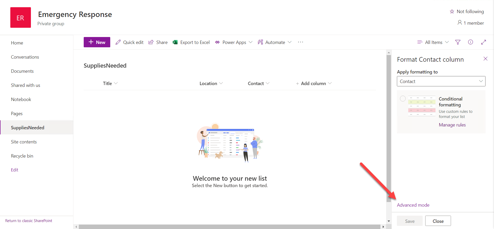

i. Click the drop-down on any of the columns and select "Show/Hide columns". De-select the Title column 1️⃣, and reorder the columns as you wish 2️⃣. Then click "Apply" 3️⃣ to update the default view of the list.

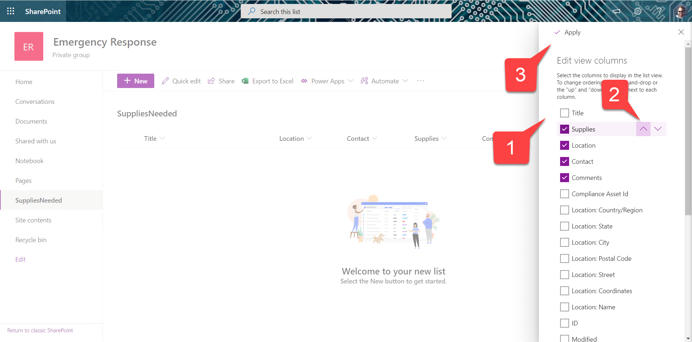

j. Enter some requests for supplies to the list as you wish.

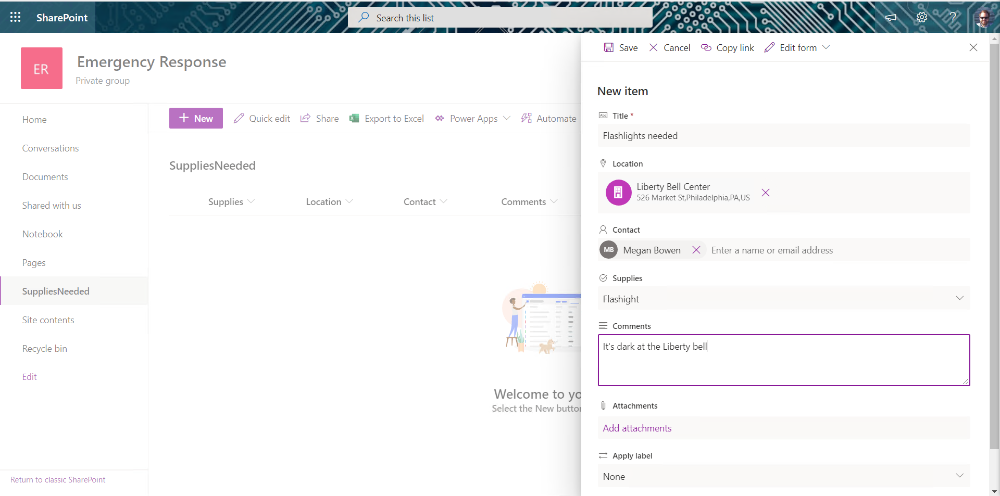

Your list should show the supply requests with special column formatting. Notice that you can click a contact name to open a Teams chat with the person.

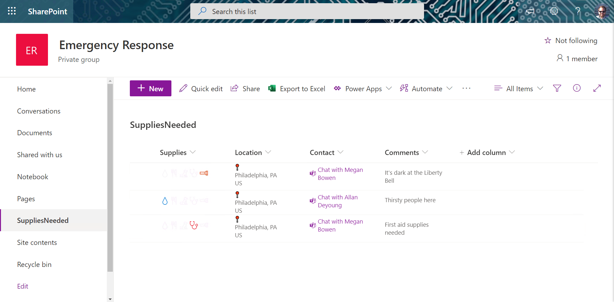

k. Save a copy of the list URL somewhere for use in a later step.

## Step 2: Add the list to your Team

In this step, you'll add the list you just created to the Emergency Response Team.

a. In the General channel, to the right of the other tabs, click the "+" to add a new tab. Find the "Lists" application and add it.

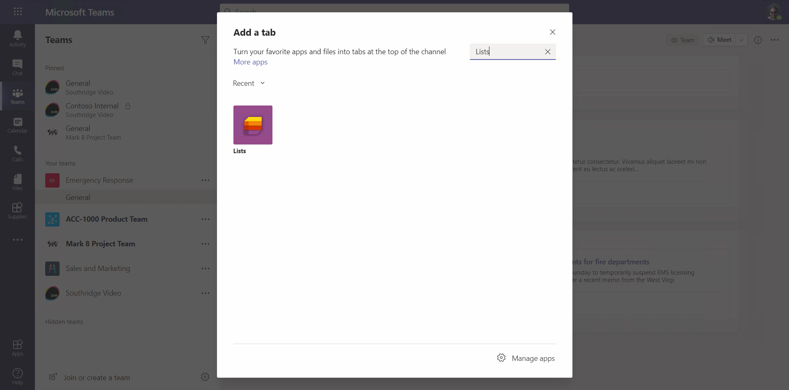

b. Click "Save" to save the tab.

c. Select "Add an existing list"

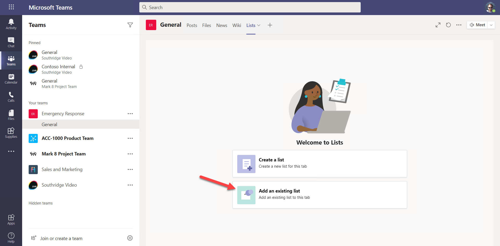

d. Select the list you created in Step 1.

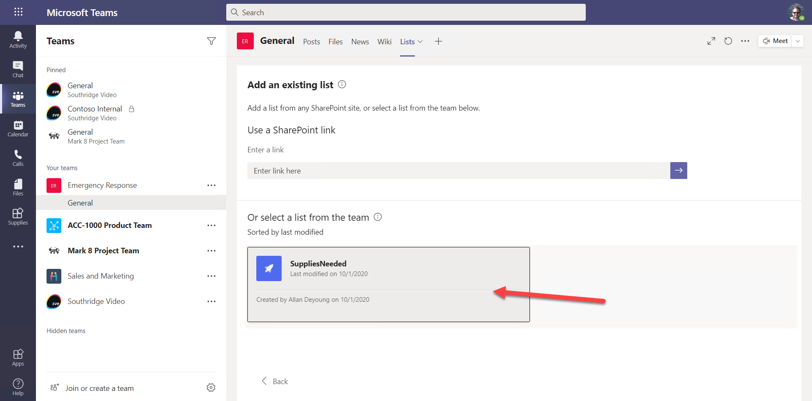

e. Your list will be displayed as a tab. Feel free to rename the columns or drag them to change the order (though Posts and Files always need to come first).

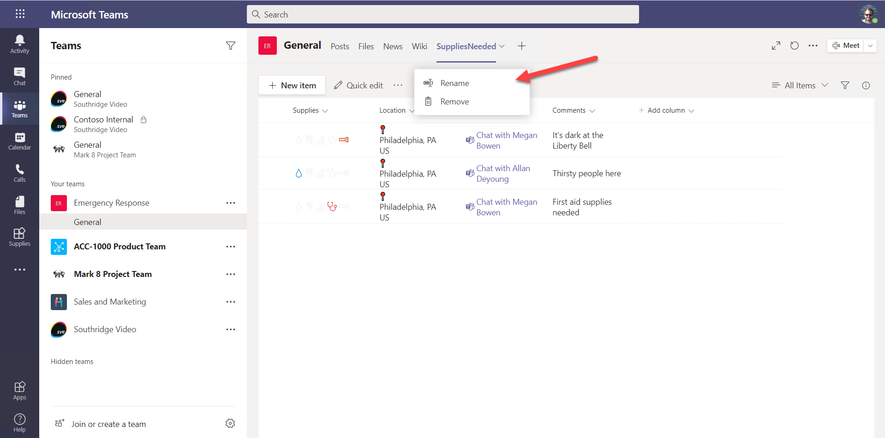

## Step 3 - Create a real Teams application using App Studio

In Step 2 you succeeded in making the list available to the Team, but you didn't actually create a Teams app, you used the Lists app. What if you wanted to make the supplies application available to people outside the Emergency Response Teams? What if you wanted to pin it to the left sidebar for the workers who should have it?

In this optional exercise, you'll do just that.

a. First, install App Studio from the Teams app catalog. In the left sidebar, click "Apps" 1️⃣, and then search for "App Studio" 2️⃣. Click on App Studio in the search results 3️⃣ to install it for yourself.

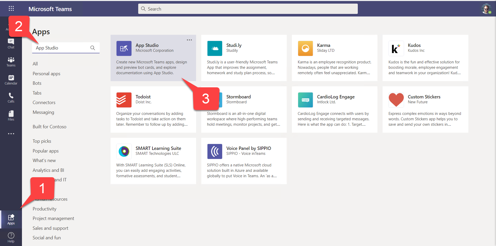

b. Go to the "Manifest editor" tab in App Studio 1️⃣ and create a new app 2️⃣.

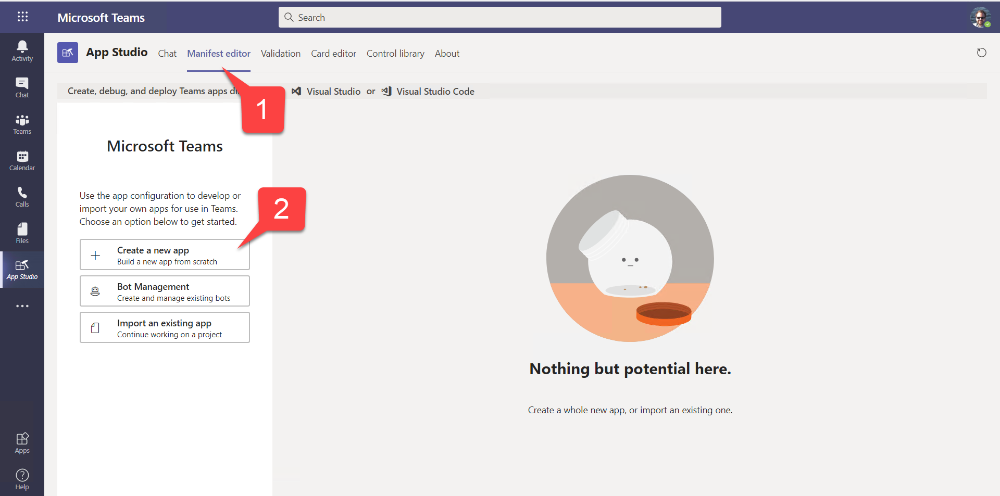

c. Fill in the app details

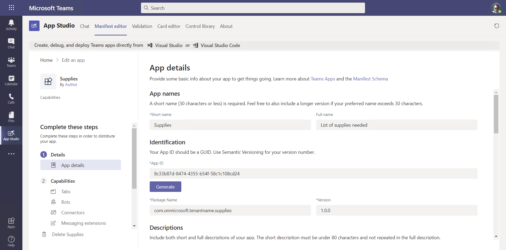

 * Give your app a short name and a full name
 * Press the "Generate" button to generate a unique ID for your app
 * Choose a unique package name. A good practice is to use a DNS domain name you own in the name to ensure uniqueness.
 * Enter short and long descriptions that will be displayed in the app's About tab
 * Enter the developer information that will be displayed in the app's About page. The website, privacy, and terms of use URLs must begin with https://.
 * Upload icons for your app. You can get suitable icons in this repository in the [Solution/Column samples](../Solution/Column%20samples) directory. If you want an accent color that matches the icons, use #20007d.

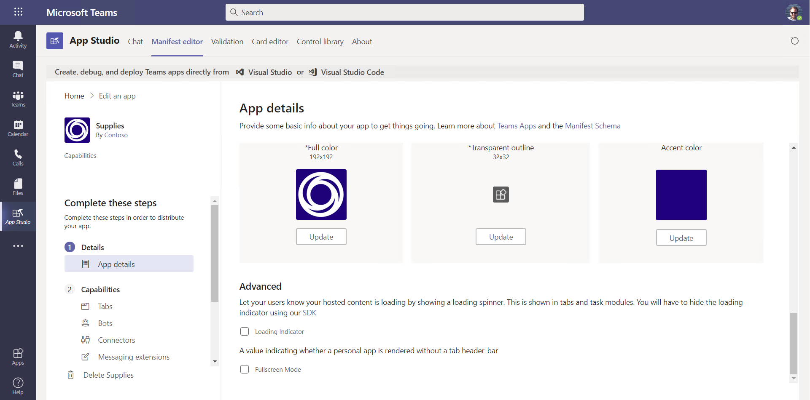

d. Under "Complete these steps," click "Tabs" 1️⃣ and add a Personal tab 2️⃣. 

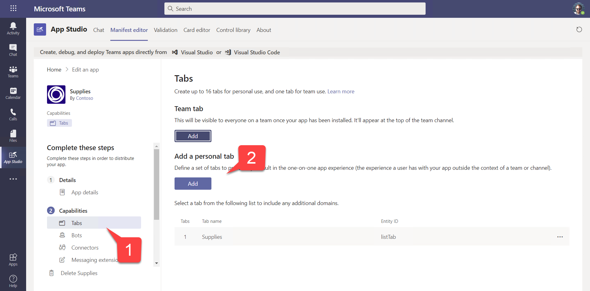

Fill in the fields as follows:

* Name: The default tab name (users can always be rename it)
* Entity ID: A unique identifier within your app. This can be used to pass context to your tab, but in this case we don't need that.
* Content URL: Paste in the list URL you saved in step 1k; you can remove everything after AllItems.aspx.
* Web URL: Paste in the list URL you saved in 1k, again removing anything after AllItems.aspx.

Don't hit save yet!

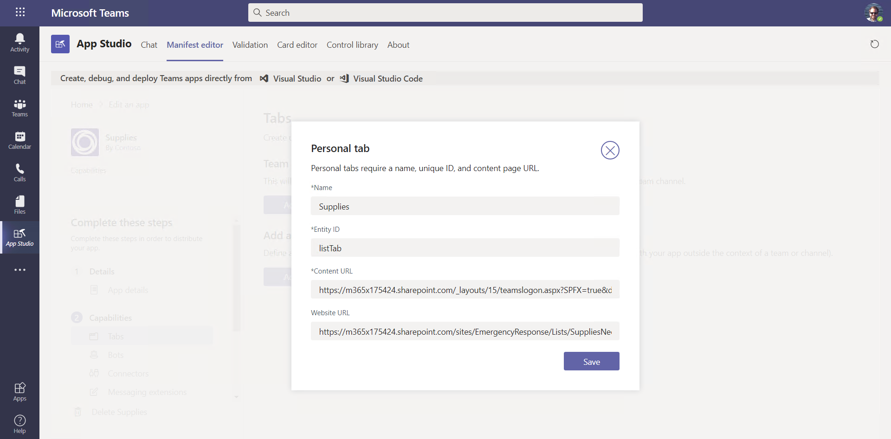

e. You need to modify the content URL before you're done, so if you saved the personal tab, edit it now. The content URL is the one displayed in the Teams app, and the web URL is only displayed if Teams needs to launch a seperate web browser. 

The problem is that the Teams app may sometimes fail to log into SharePoint, so we need to modify the content URL to force the login. (SharePoint veterans may appreciate that the tab will fail when SharePoint's FedAuth cookie expires ... remember the FedAuth cookie? It's still around!)

You need to insert `/_layouts/15/teamslogon.aspx?SPFX=true&dest=` into the URL right after the host name. So, for example, if your list URL is

~~~ text
https://m365x123456.sharepoint.com/sites/EmergencyResponse/Lists/SuppliesNeeded/AllItems.aspx
~~~

the content URL should be

~~~ text
https://m365x175424.sharepoint.com/_layouts/15/teamslogon.aspx?SPFX=true&dest=/sites/EmergencyResponse/Lists/SuppliesNeeded/AllItems.aspx
~~~

Now you can save your work.

NOTE: This functionality is in preview and subject to change. [Details are in this article](https://docs.microsoft.com/en-us/sharepoint/dev/features/embed-pages-to-teams).

f. Test your app by installing it for your own use. Under "Complete these steps" scroll down and select "Test and distribute" 1️⃣. Then click the "Install" button 2️⃣.
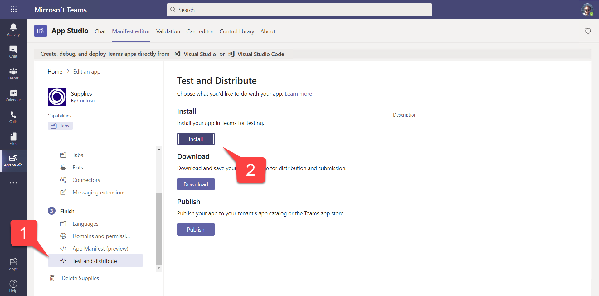

Notice that the information from your app manifest appears in the dialog box.

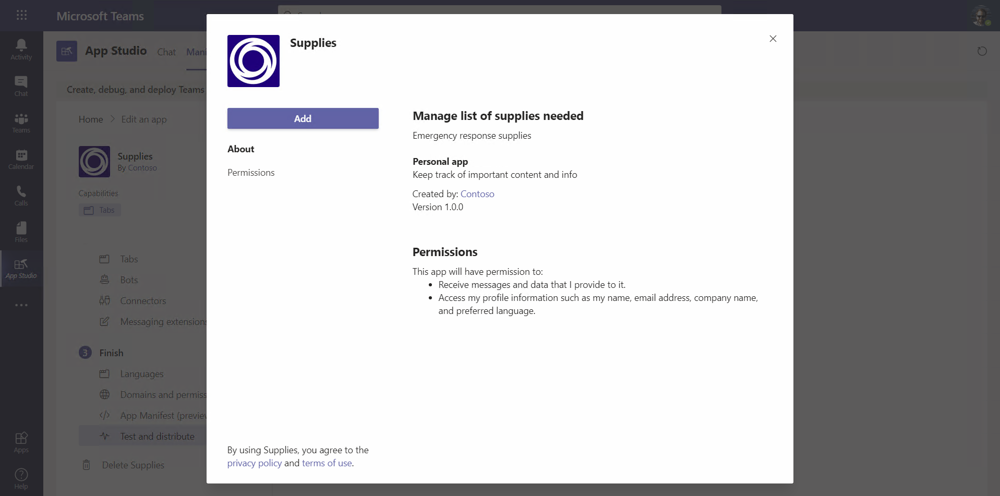

g. The app should open and you can view and edit the supplies list. If you right-click on the app in the sidebar 1️⃣ and click "Pin" 2️⃣, the app will stay on your sidebar. 

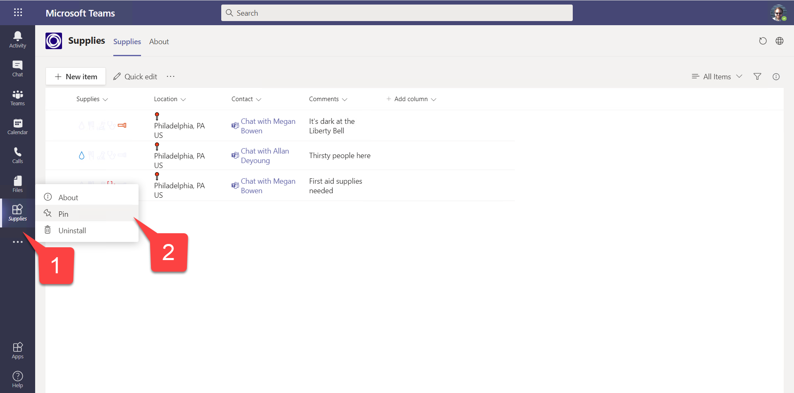

## Step 4: Install and pin the app using App Policies

a. Re-open App Studio, which will be under the elipsis in the Teams sidebar 1️⃣. Edit the your app manifest 2️⃣ and return to the "Test and distribute" task 3️⃣. This time, click Download 4️⃣ and save a copy of the application package (.zip file) on your computer.

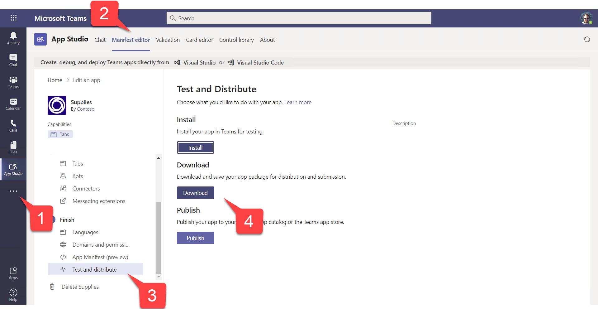

Take a moment to open the zip archive. You will find the two icons and a file called manifest.json, suitable for checking into your favorite source control system. All the information you entered in App Studio there.

b. Click Apps in the Teams sidebar 1️⃣, then click "Upload a custom app" 2️⃣. If you are a Teams administrator, you will see your tenant name as an option 3️⃣; select that to upload the app to your enterprise app catalog.

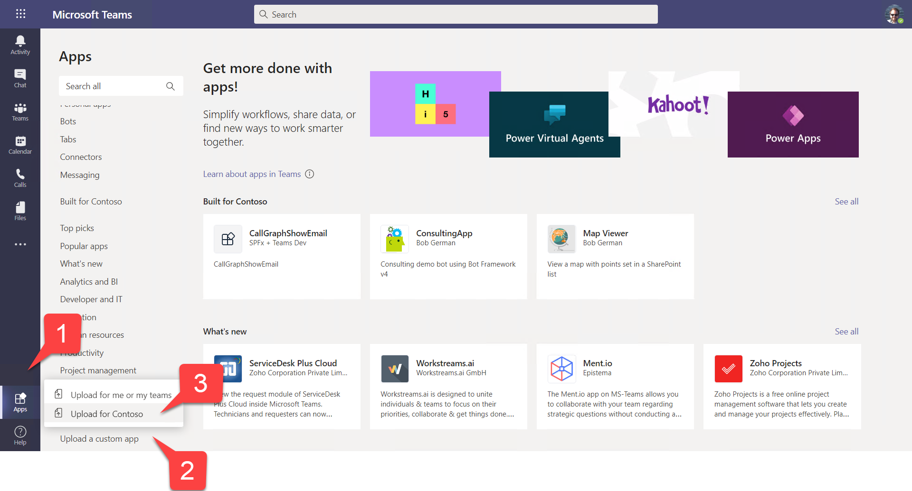

Now when you click the "Built for (tenant name)" link, your app will be listed.

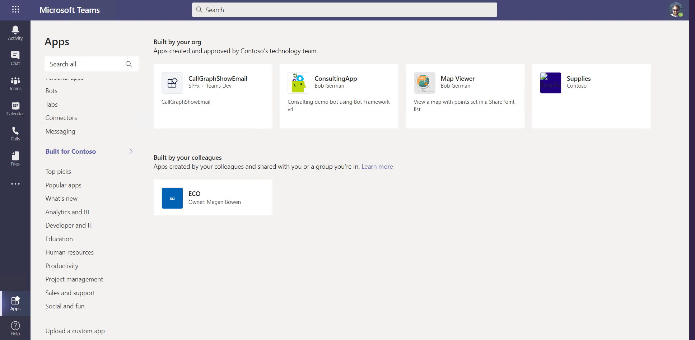

c. Open the [Teams admin site](https://admin.teams.microsoft.com/) and, under "Teams apps" 1️⃣ select "Setup policies" 2️⃣. Click the "+" 3️⃣ to add a new policy.

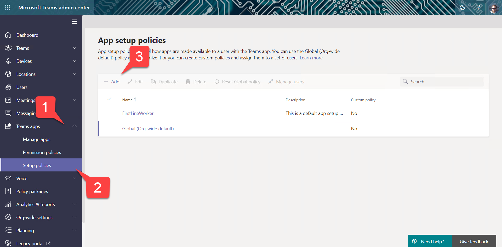

Give your policy a name 1️⃣ and click "Add apps" 2️⃣ to install an app for the users affected.

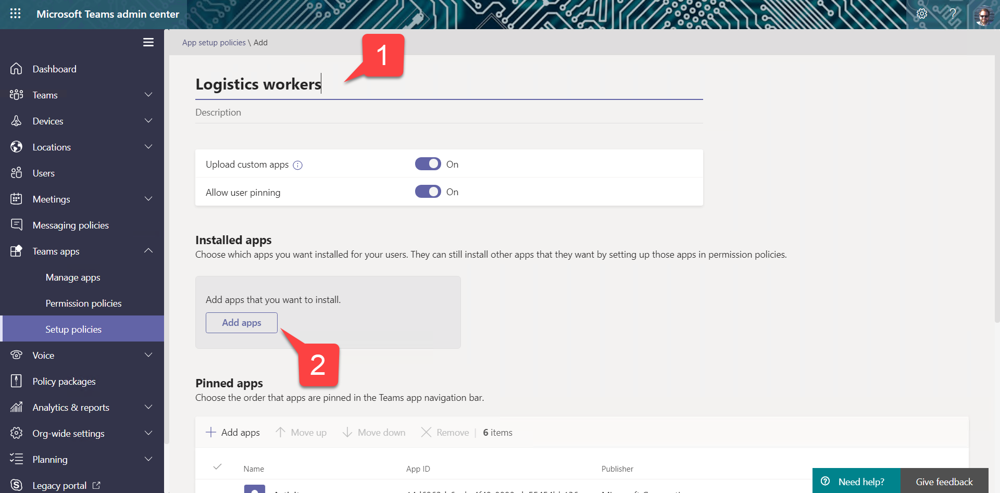

Search for the Supplies app 1️⃣ and click or hover over the name 2️⃣ when it pops up. This will make an "Add" button 3️⃣appear; click it and then click "Save" 4️⃣.

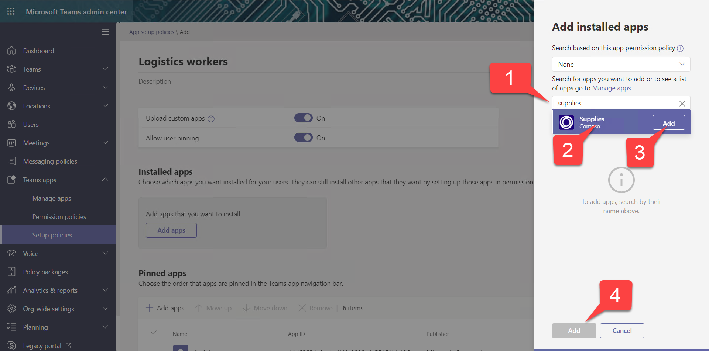

Now scroll down and add a pinned app. Same as before, add the Supplies app to pin it for all users affected by the policy. Scroll down and click Save to create the App Setup Policy.

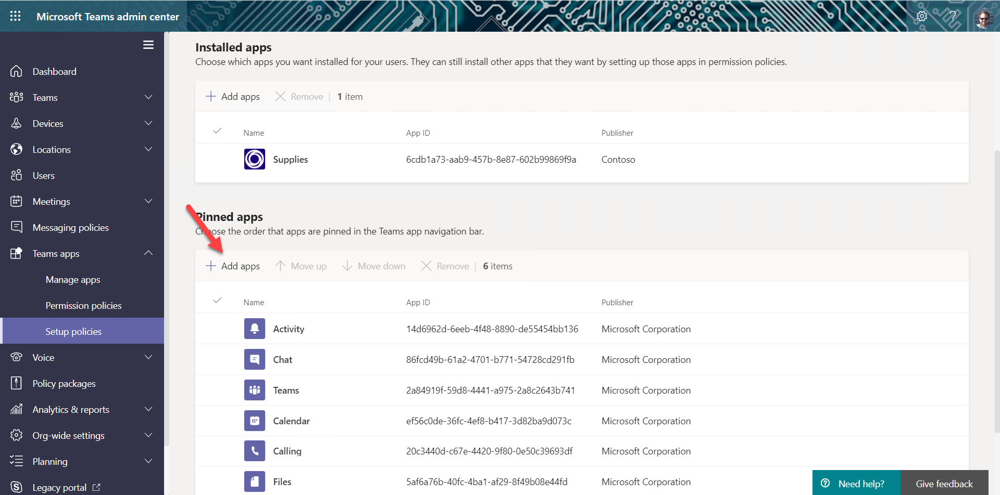

d. Back at the list of setup policies, select the policy you just created and "Manage users" to select the users who the policy will apply to. It is currently only possible to add individual users and not Teams or groups. If you wish it worked for groups, please vote for [this UserVoice suggestion](https://microsoftteams.uservoice.com/forums/555103-public/suggestions/38130793-add-ability-to-assign-teams-apps-setup-policies).

It can take up to 24 hours for the app policy to take effect.

When you're ready, please [proceed to the next section.](Part4.md)

## Challenges

1. Make your app work in a Teams channel (rather than using the Lists app)

   In order to build an app with tabs that work in Teams channels and group conversations, you need to create a configuration page. There's a SharePoint web part sample that does just that, so you can make any SharePoint page into a configuration page.

   Visit the [article which explains](https://bob1german.com/2020/01/07/teams-apps-with-sharepoint2/) and try it out with the Supplies list.

