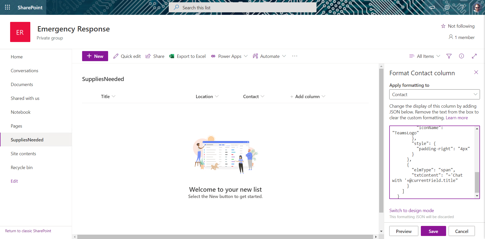
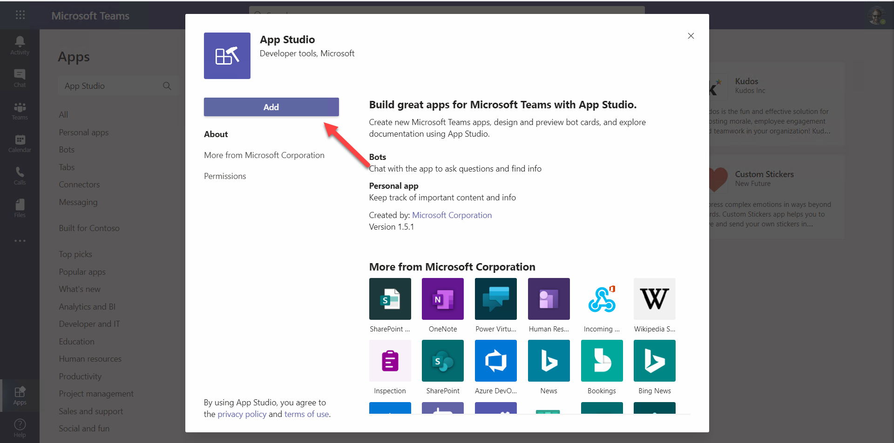
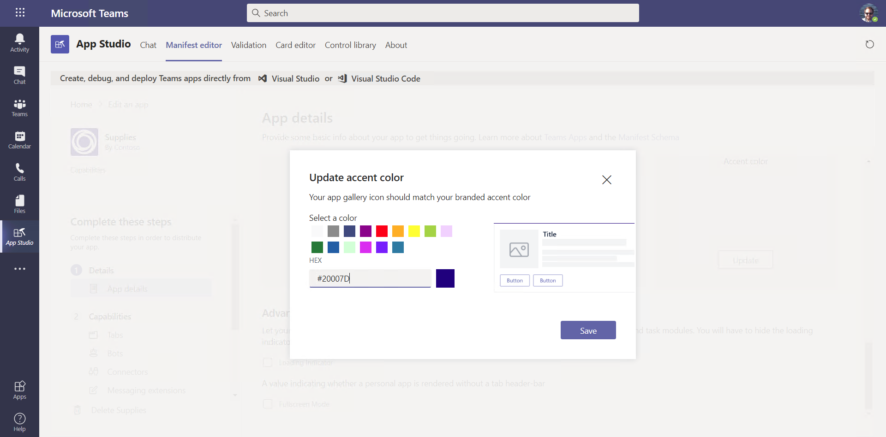
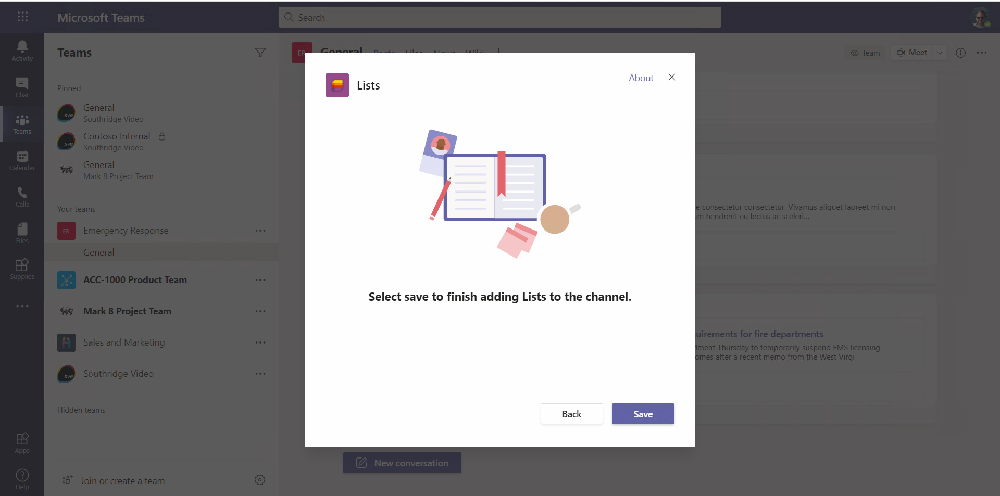

# Part 3: SharePoint List Tab

 * [Exercise 1: Lab setup](Part1.md)
 * [Exercise 2: SharePoint News](Part2.md)
 * [Exercise 3: SharePoint List Tab](Part3.md) **(You are here)**
 * [Exercise 4: SharePoint Framework tabs](Part4.md)
 * [Exercise 5: Calling the Microsoft Graph](Part5.md)
 * [Challenges: Ideas for going beyond the lab exercises](Challenges.md)
 * [Resources](Resources.md)

In this exercise you'll create a Teams application for managing inventory needs during an emergency. The app will be implemented as a SharePoint list, and published as a Teams tab.

## Step 1: Create the SharePoint list

https://m365x175424.sharepoint.com/sites/EmergencyResponse/Lists/SuppliesNeeded/AllItems.aspx
insert
/_layouts/15/teamslogon.aspx?SPFX=true&dest=
becomes
https://m365x175424.sharepoint.com/_layouts/15/teamslogon.aspx?SPFX=true&dest=/sites/EmergencyResponse/Lists/SuppliesNeeded/AllItems.aspx

#20007d

## Challenges

1. Export and install for the whole tenant. Create an app policy for the Supply Team and add yourself to it. Implement an App Settings Policy to pin the app for the Supply Team.

2. Make it work as an app in a Teams tab

 When you're ready, please [proceed to the next section.](Part4.md)