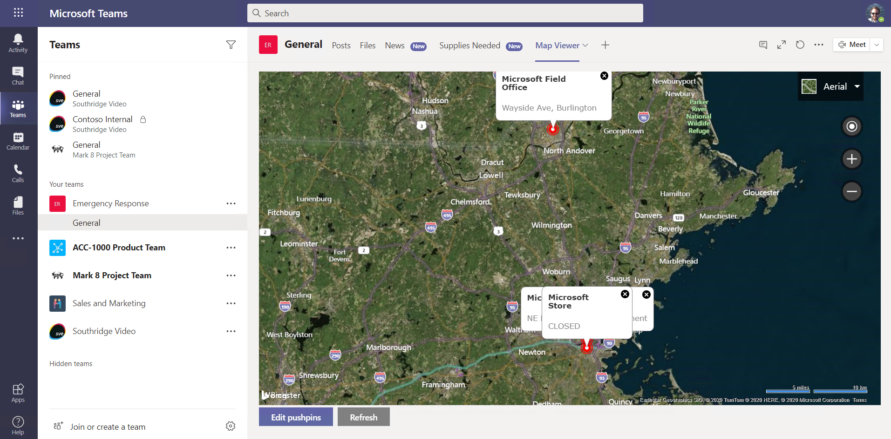

# Part 5: Calling the Microsoft Graph

 * [Exercise 1: Lab setup](Part1.md)
 * [Exercise 2: SharePoint News](Part2.md)
 * [Exercise 3: SharePoint List Tab](Part3.md)
 * [Exercise 4: SharePoint Framework tabs](Part4.md)
 * [Exercise 5: Calling the Microsoft Graph](Part5.md) **(You are here)**
 * [Challenges: Ideas for going beyond the lab exercises](Challenges.md)
 * [Resources](Resources.md)

Congratulations, you've completed all 5 parts of the workshop! Please check out these pages:
 * [Challenges](Challenges.md): ideas on how to go beyond the labs
 * [Resources](Resourcs.md): links to documentation and learning resources
