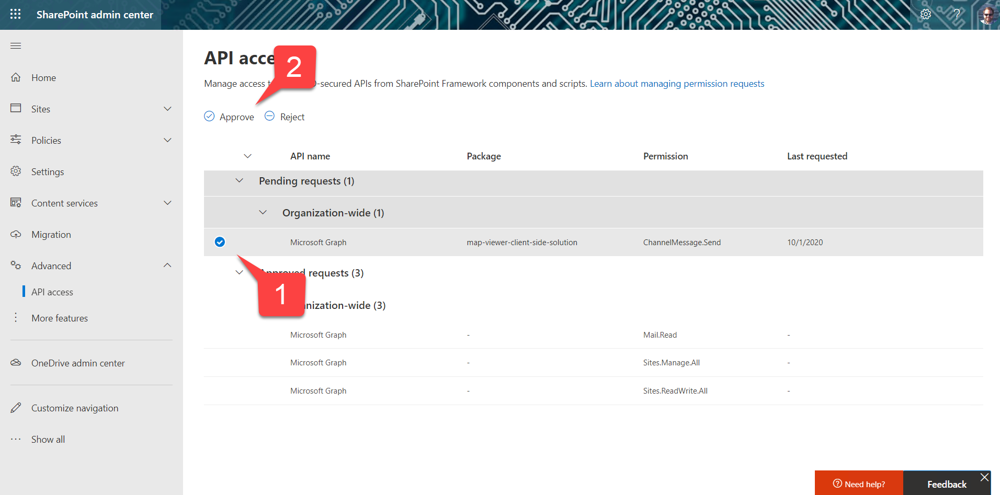
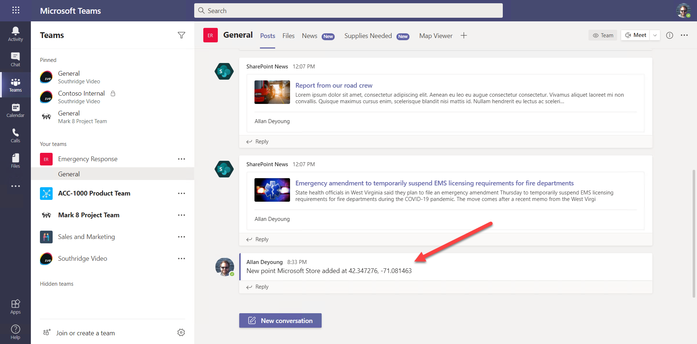

# Part 5: Calling the Microsoft Graph

 * [Exercise 1: Lab setup](Part1.md)
 * [Exercise 2: SharePoint News](Part2.md)
 * [Exercise 3: SharePoint List Tab](Part3.md)
 * [Exercise 4: SharePoint Framework tabs](Part4.md)
 * [Exercise 5: Calling the Microsoft Graph](Part5.md) **(You are here)**
 * [Challenges: Ideas for going beyond the lab exercises](Challenges.md)
 * [Resources](Resources.md)

In this exercise, you'll add code to the solution which posts a message in the Teams channel when a new map point is added. The completed solution is in the ["Exercise 5" branch](#) of this repo.

If you don't have developer tools, grab the map-view.sppkg file from the Exercise 5 folder and skip to Step 3.

## Step 1: Modify the code

a. Open the [Solution/MapViewer](../Solution/MapViewer/) folder in your code editor. 

The [src/webparts/mapView/services/GraphService](../Solution/MapViewer/src/webparts/mapView/services/GraphService) folder contains the Microsoft Graph code for the solution. Open IGraphService.ts and add a function to the IGraphService interface:

~~~typescript
sendToChannel(message: string): Promise<void | string>;
~~~

b. In the GraphService.ts file, import a reference to the Teams JavaScript SDK at the top of the file.

~~~typescript
import * as microsoftTeams from "@microsoft/teams-js";
~~~

Then add a function to get the Teams context from the Teams JavaScript SDK.

~~~typescript
private async getTeamsContext(): Promise<any> {

    return new Promise<any> ((resolve, reject) => {
        if (microsoftTeams) {
            microsoftTeams.getContext((context) => {
                resolve(context);
            });
        } else {
            reject ("Error: Teams context not found");
        }    
    });
}
~~~

Finally, add a function to send a message to the current Teams channel using the Microsoft Graph.

~~~typsecript
public async sendToChannel(message: string): Promise<void | string> {

    const teamsContext = await this.getTeamsContext();
    const teamId = teamsContext.groupId;
    const channelId = teamsContext.channelId;

    return new Promise<void | string>((resolve, reject) => {
        this.serviceProps.graphClient.api(
            `/teams/${teamId}/channels/${channelId}/messages`)
            .post({
                body: {
                    content: message,
                    contentType: "text"
                }
            }, ((err, res) => {
                if (!err) {
                    resolve();
                } else {
                    reject(err);
                }
            }));
    });
}
~~~

The completed file is [here](#).

c. The [src/webparts/mapView/services/MapDataService](../Solution/MapViewer/src/webparts/mapView/services/MapDataService) folder contains the code that reads and updates map points using the Graph service and the Bing Maps service. Modify .MapDataService[MapDataService.ts](../Solution/MapViewer/src/webparts/mapView/services/MapDataService/MapDataService.ts) to add a call to the new `sendToChannel()` function. Add it to the `getMapPoints()` function just below the call to `updateListItem()`. The updated `getMapPoints()` function should look like this:

~~~typescript
public async getMapPoints(geocode: boolean): Promise<ILocation[]> {

    const locationMapper = new LocationMapper();

    let listId: string;
    try {
        listId = await this.serviceProps.graphService.getListId(
            this.serviceProps.siteId, this.serviceProps.listName
        );    
    }
    catch (error) {
        if (error.statusCode === 404) {
            listId = await this.serviceProps.graphService.createList(
                this.serviceProps.siteId, this.serviceProps.listName,
                locationMapper
            );
        } else throw(error);
    }

    const points = await this.serviceProps.graphService.getListItems<ILocation>(
        this.serviceProps.siteId, listId, locationMapper
    );

    if (geocode) {
        for (let p of points) {
            if ((!p.latitude || !p.longitude) &&
                    (p.address || p.city || p.stateProvince || p.country)) {
                
                // If here, we're missing the geo-coordinates for an item and have
                // address or other info. Try to geocode it.
                let coordinates = await this.serviceProps.bingMapsService.geoCode(
                    p.country, p.stateProvince, p.city, p.address
                );

                if (typeof coordinates === 'object') {
                    // If here, the geocode was succesful - update the item
                    p.latitude = coordinates.latitude;
                    p.longitude = coordinates.longitude;
                    await this.serviceProps.graphService.updateListItem(
                        this.serviceProps.siteId, listId, locationMapper, p.id,
                        {
                            latitude: p.latitude,
                            longitude: p.longitude
                        }
                    );
                    await this.serviceProps.graphService.sendToChannel(
                        `New point ${p.title} added at ${p.latitude}, ${p.longitude}`
                    );
                }
            }
        }
    }

    return (points);
}
~~~

d. We're going to need permission to use the Graph API to post in the Teams channel. To request this, edit the [config/package-solution.json](../Solution/MapViewer/config/package-solution.json) and add a new item in the `webApiPermissionRequests` array:

~~~json
      {
        "resource": "Microsoft Graph",
        "scope": "ChannelMessage.Send"
      }
~~~

Don't forget to comma separate the array items! The completed package-solution.json file should look like this:

~~~json
{
  "$schema": "https://developer.microsoft.com/json-schemas/spfx-build/package-solution.schema.json",
  "solution": {
    "name": "map-viewer-client-side-solution",
    "id": "3f215ef6-ff06-4858-9195-a3eb4b3e1f20",
    "version": "1.0.0.0",
    "includeClientSideAssets": true,
    "skipFeatureDeployment": true,
    "webApiPermissionRequests": [
      {
        "resource": "Microsoft Graph",
        "scope": "Sites.ReadWrite.All"
      },
      {
        "resource": "Microsoft Graph",
        "scope": "Sites.Manage.All"
      },
      {
        "resource": "Microsoft Graph",
        "scope": "ChannelMessage.Send"
      }
    ],
    "isDomainIsolated": false,
    "developer": {
      "name": "Bob German",
      "websiteUrl": "https://bob1german.com",
      "privacyUrl": "https://privacy.microsoft.com",
      "termsOfUseUrl": "https://opensource.microsoft.com/",
      "mpnId": ""
    }
  },
  "paths": {
    "zippedPackage": "solution/map-viewer.sppkg"
  }
}
~~~

## Step 2: Rebuild the SharePoint solution package

a. If you're running locally, you can make simple code changes without re-deploying the SharePoint solution package, but in this case we added a permission request so it's time to rebuild the package.

Return to the command line to rebuild the solution package. If you're running locally,

~~~bash
gulp bundle
gulp package-solution
~~~

If you want to deploy the JavaScript bundle to the SharePoint CDN,

~~~bash
gulp bundle --ship
gulp package-solution --ship
~~~

## Step 3: Re-deploy the SharePoint solution package and approve permissions

a. Return to the SharePoint App catalog and upload the map-viewer.sppkg file again.

b. Return to the API Access screen; you should see the new permission . Select it 1️⃣ and click Approve 2️⃣. 

## Step 4: Test the change

a. Return to Microsoft Teams and refresh the Map View tab. Add a new point to the map; a notification should appear in the channel.

Congratulations, you've completed all 5 parts of the workshop! Please check out these pages:
 * [Challenges](Challenges.md): ideas on how to go beyond the labs
 * [Resources](Resourcs.md): links to documentation and learning resources
