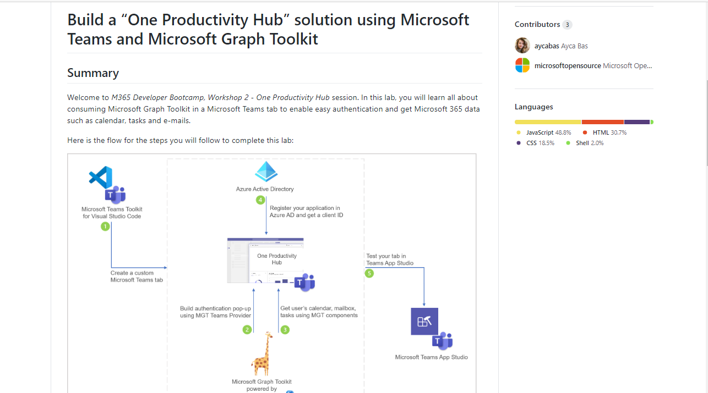

# Resources

## Labs in this workshop

 * [Exercise 1: Lab setup](Part1.md)
 * [Exercise 2: SharePoint News](Part2.md)
 * [Exercise 3: SharePoint List Tab](Part3.md)
 * [Exercise 4: SharePoint Framework tabs](Part4.md)
 * [Exercise 5: Calling the Microsoft Graph](Part5.md)
 * [Challenges: Ideas for going beyond the lab exercises](Challenges.md)
 * [Resources](Resources.md) **(You are here)**

## Teams application development

 * [Teams Developer documentation](https://docs.microsoft.com/microsoftteams/platform/?WT.mc_id=M365-github-rogerman/) - New and improved!

  * [App studio installation instructions](https://docs.microsoft.com/microsoftteams/platform/concepts/build-and-test/app-studio-overview?WT.mc_id=M365-github-rogerman)
 * [Teams Toolkit for Visual Studio Code](https://docs.microsoft.com/microsoftteams/platform/toolkit/visual-studio-code-overview?WT.mc_id=M365-github-rogerman)
 * [Teams Toolkit for Visual Studio](https://docs.microsoft.com/microsoftteams/platform/toolkit/visual-studio-overview?WT.mc_id=M365-github-rogerman)
 * [Microsoft Learn: Introduction to building apps for Microsoft Teams](https://docs.microsoft.com/en-us/learn/modules/intro-microsoft-teams-apps/) - Hands-on labs and certification study materials on Teams development using "yo Teams"
 * [Microsoft Teams code samples](https://docs.microsoft.com/microsoftteams/platform/tutorials/code-samples?WT.mc_id=M365-github-rogerman) (showing each type of Teams extension in .NET Core, Node.js, and Python -  from  Microsoft)
 * [Microsoft Teams App Templates](https://docs.microsoft.com/microsoftteams/platform/samples/app-templates?WT.mc_id=M365-github-rogerman) (complete applications from Microsoft)
 * [Microsoft Teams code sample browser](https://aka.ms/TeamsDevSamples) (from Microsoft and the community)

## Videos

 * [Microsoft 365 Developer YouTube channel](https://www.youtube.com/channel/UCV_6HOhwxYLXAGd-JOqKPoQ)
 * [Microsoft PnP YouTube Channel](https://www.youtube.com/channel/UC_mKdhw-V6CeCM7gTo_Iy7w)
 * [SharePoint Framework tutorials](https://www.youtube.com/watch?v=yc1IYgYp7qQ&list=PLR9nK3mnD-OXvSWvS2zglCzz4iplhVrKq)
 * [Bob's Teams Dev videos](https://www.youtube.com/playlist?list=PLBq5d5RRcDu4sSe5snZKyn23Gg0850ul_)

## SharePoint Pages as Apps

 * [Embedding modern SharePoint pages in Microsoft Teams as personal apps (preview)](https://docs.microsoft.com/en-us/sharepoint/dev/features/embed-pages-to-teams)
 * [Building Microsoft Teams apps with SharePoint pages](https://bob1german.com/2020/01/06/teams-apps-with-sharepoint1/) (Blog articles)

## SharePoint Framework in Teams
 
 * [SharePoint Framework overview](https://docs.microsoft.com/sharepoint/dev/spfx/sharepoint-framework-overview?WT.mc_id=M365-github-rogerman)
 * [Set up your SharePoint Framework development environment](https://docs.microsoft.com/en-us/sharepoint/dev/spfx/set-up-your-development-environment)
 * [SharePoint Framework tutorials](https://developer.microsoft.com/office/blogs/getting-started-with-sharepoint-framework-tutorials/?WT.mc_id=M365-github-rogerman)
 * [Build for Microsoft Teams using SharePoint Framework](https://docs.microsoft.com/sharepoint/dev/spfx/build-for-teams-overview?WT.mc_id=M365-github-rogerman)
  * [Configurable tabs in SharePoint](https://github.com/pnp/sp-dev-fx-webparts/tree/master/samples/react-teams-configure-tab)

## More

Please check out the companion workshop, [Build a "One Productivity Hub" solution using Microsoft Teams and Microsoft Graph Toolkit](https://github.com/OfficeDev/M365Bootcamp-TeamsOneProductivityHub)
 

