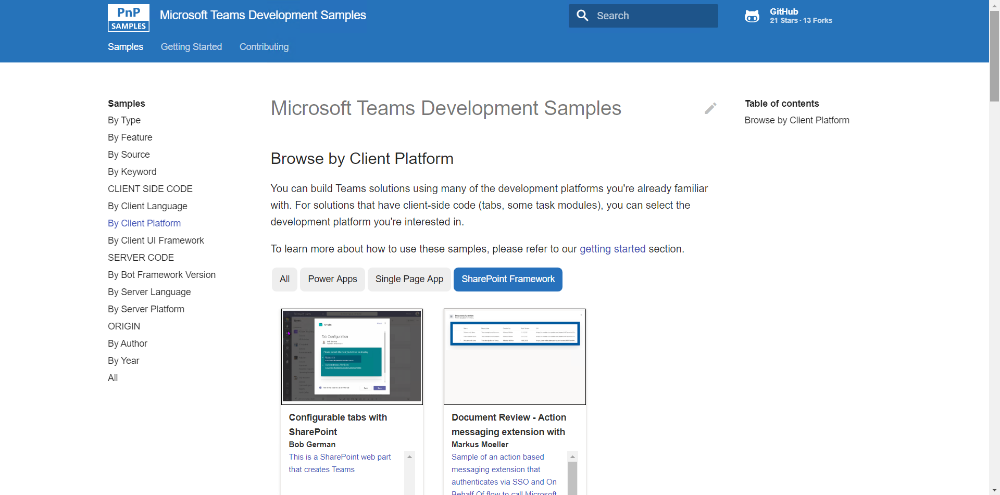
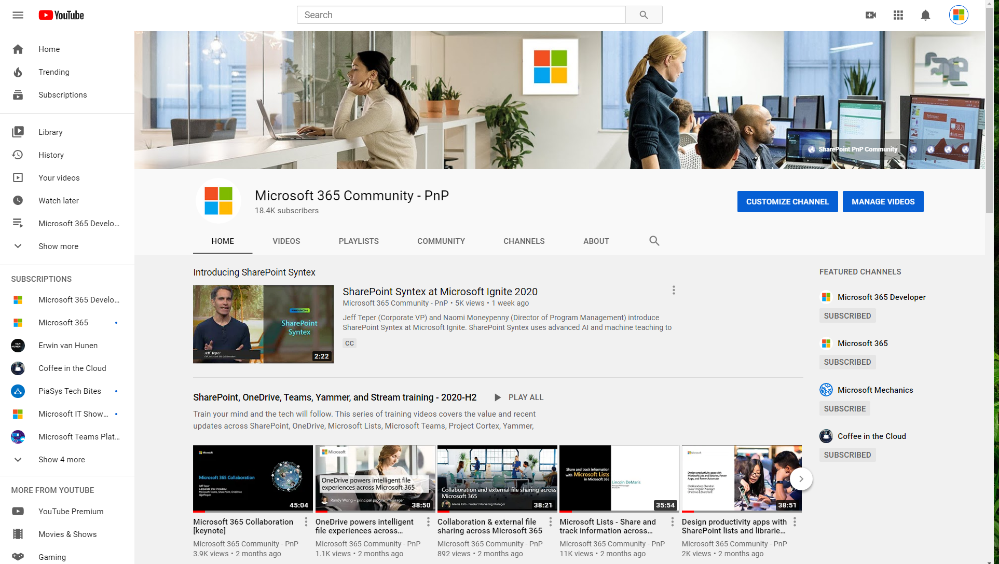
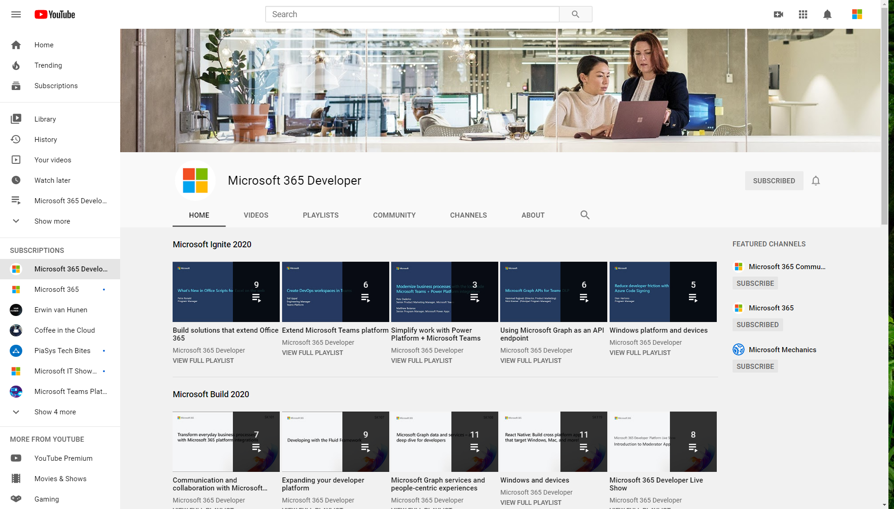
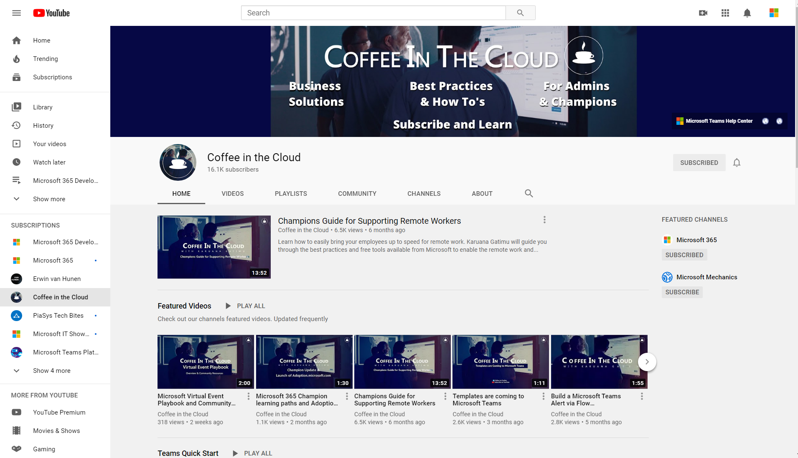

# Resources

 * [Exercise 1: Lab setup](Part1.md)
 * [Exercise 2: SharePoint News](Part2.md)
 * [Exercise 3: SharePoint List Tab](Part3.md)
 * [Exercise 4: SharePoint Framework tabs](Part4.md)
 * [Exercise 5: Calling the Microsoft Graph](Part5.md)
 * [Challenges: Ideas for going beyond the lab exercises](Challenges.md)
 * [Resources](Resources.md) **(You are here)**

## STILL WORKING ON THIS PAGE

links to documentation and learning resources

 [Building Microsoft Teams apps with SharePoint pages](https://bob1german.com/2020/01/06/teams-apps-with-sharepoint1/)

 [App studio installation instructions](https://docs.microsoft.com/en-us/microsoftteams/platform/concepts/build-and-test/app-studio-overview)

New [Teams Developer documentation](https://docs.microsoft.com/en-us/microsoftteams/platform/)

Andrew's [Learn Module](https://docs.microsoft.com/en-us/learn/modules/intro-microsoft-teams-apps/)

 
 
 
 

 TypeScript Site
http://bit.ly/SPF-TypeScript
TypeScript Playground
http://bit.ly/TSPlayground
Bob’s TS “Cheat Sheets”
http://bit.ly/LearnTypeScript
WebPack Site
http://bit.ly/SPF-WebPack
SharePoint REST API reference
http://bit.ly/SP-REST
Gulp task runner
http://bit.ly/SPF-Gulp
Visual Studio Code
http://bit.ly/SPF-VSCode
Dev Setup
http://bit.ly/SPFx-DevSetup 
Build your first Web Part
http://bit.ly/SPFx-FirstWP
SPFx Labs
http://bit.ly/SPFx-Labs 
Teams Application Development
Teams and SPFx Walk-through
http://bit.ly/SPF-WebPack
Teams Labs
http://bit.ly/TeamsDevLabs 
Field visit demo
http://bit.ly/FieldVisitDemo 
Graph API
http://bit.ly/MSGraphAPI 
SharePoint REST API
http://bit.ly/MSSharePointAPI 
SharePoint Developer Community
http://bit.ly/SPDevCommunity 

