# Build an Emergency Response solution with Teams and SharePoint

In this half day workshop, you will learn how to build solutions with Microsoft Teams and Microsoft SharePoint. In the process, you will build a simple Emergency Response Center which could be used to coordinate the response to an emergency such as a natural disaster. This could complement the [Crisis Communication Power App template](https://powerapps.microsoft.com/en-us/blog/crisis-communication-a-power-platform-template/), which helps to keep employees informed during a crisis; this solution is for the reponse team themselves.

You will build:

 * A SharePoint communication site for publishing news to the response team and others

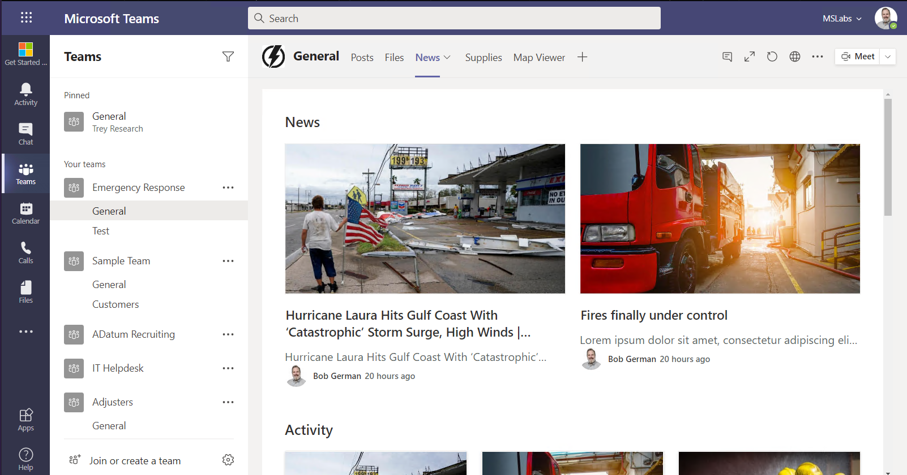

 * A tab for coordinating supplies and where they're needed, based on a SharePoint list

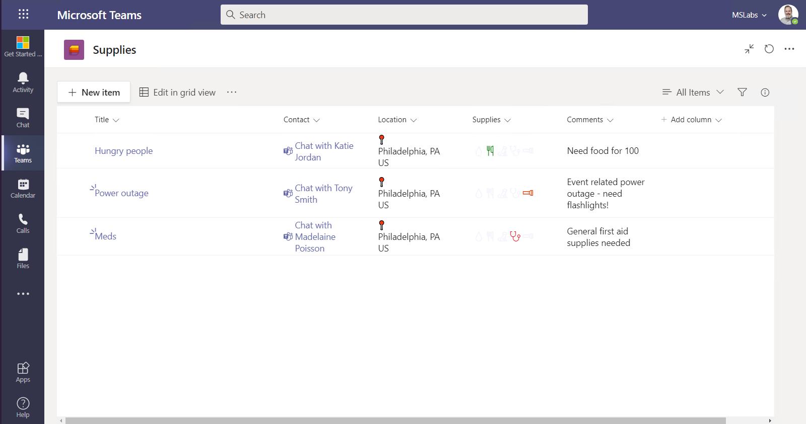

 * A tab for viewing problem locations on a map, written in SharePoint Framework and backed by another SharePoint list using Microsoft Graph

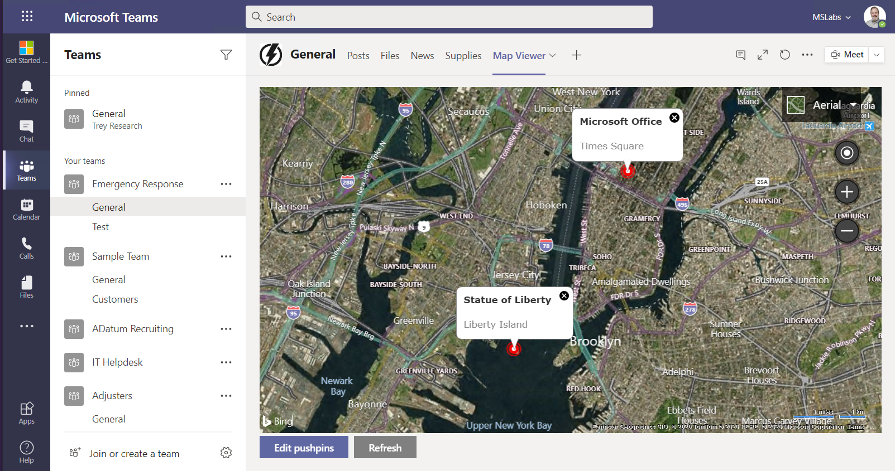

## The Workshop

 * [Exercise 1: Lab setup](Labs/Part1.md)
 * [Exercise 2: SharePoint News](Labs/Part2.md)
 * [Exercise 3: SharePoint List Tab](Labs/Part3.md)
 * [Exercise 4: SharePoint Framework tabs](Labs/Part4.md)
 * [Exercise 5: Calling the Microsoft Graph](Labs/Part5.md)
 * [Resources](Labs/Resources.md)

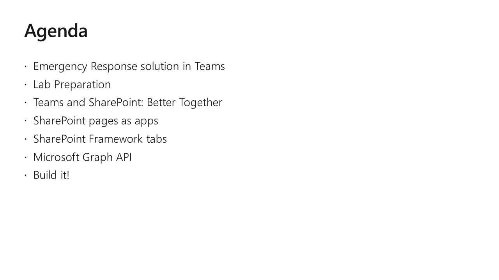

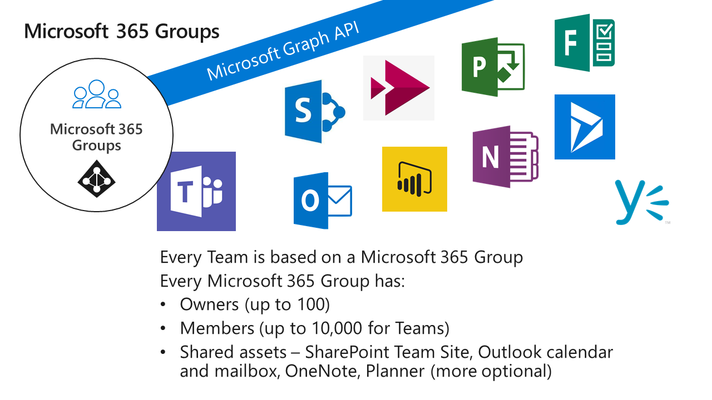

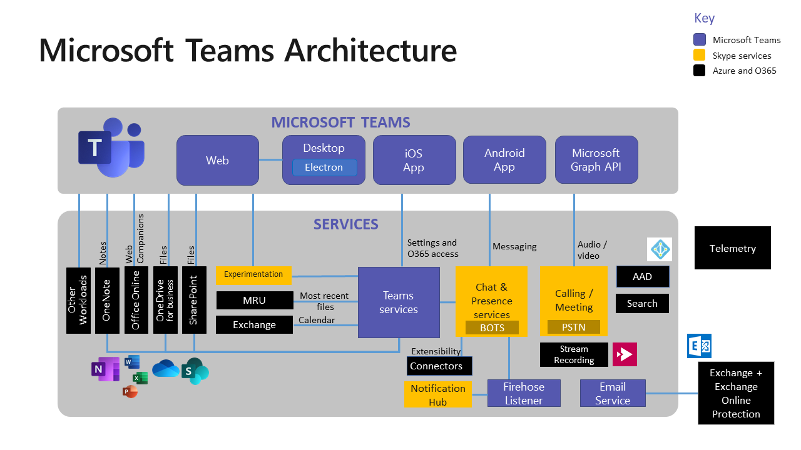

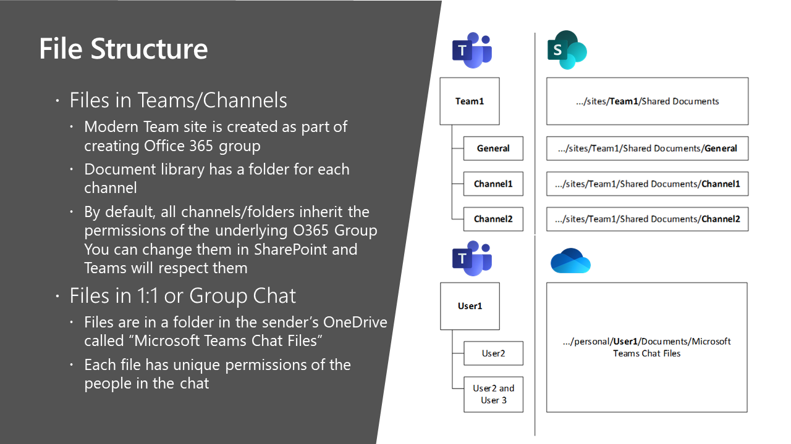

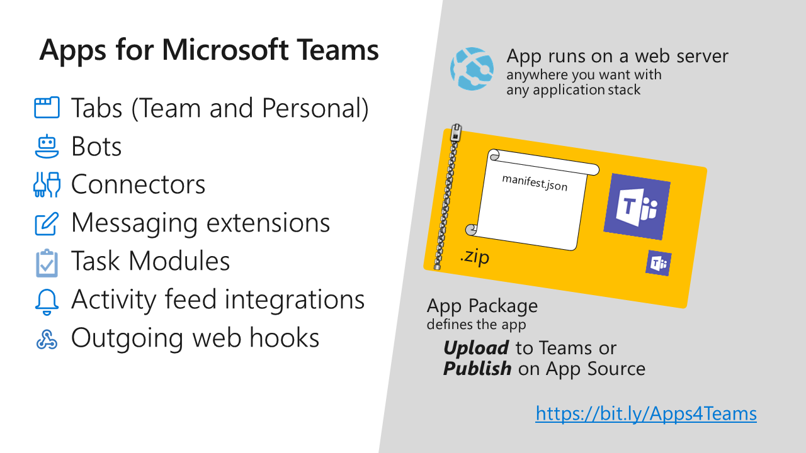

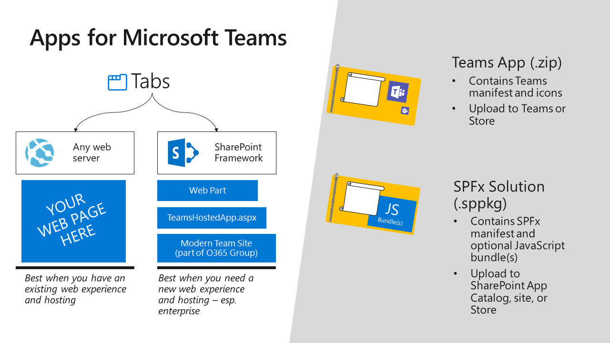

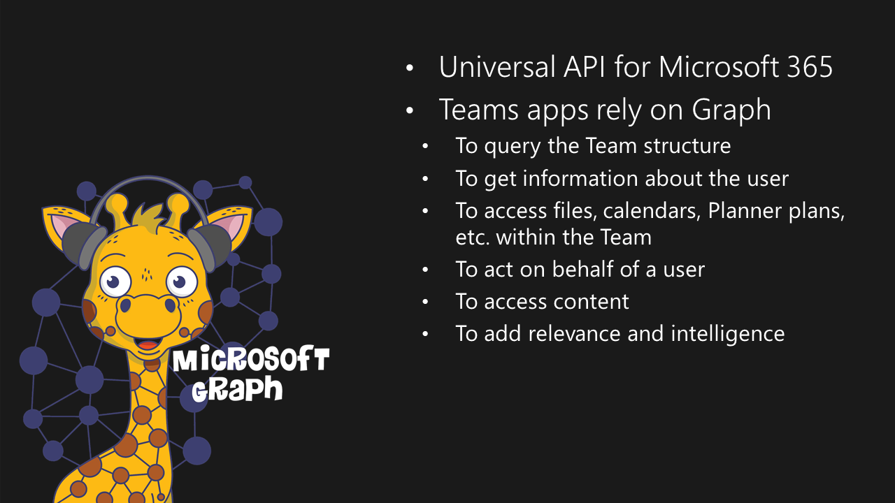

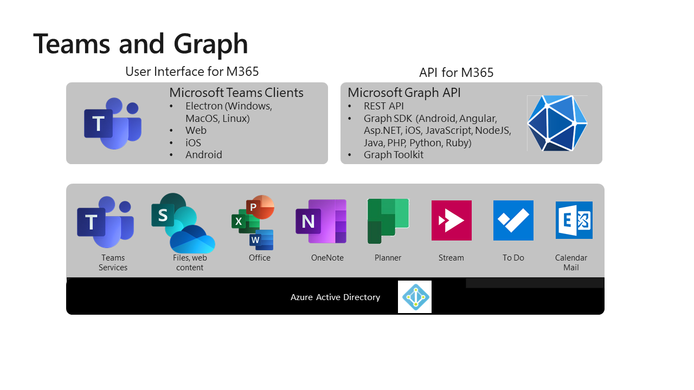

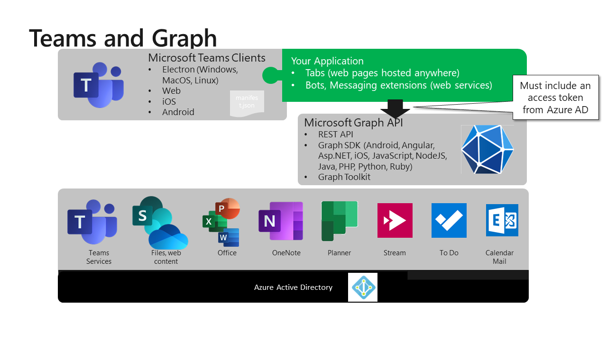

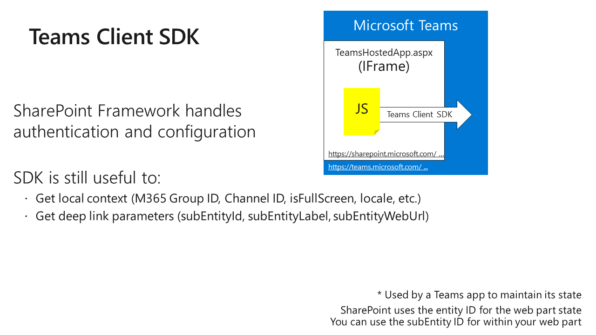

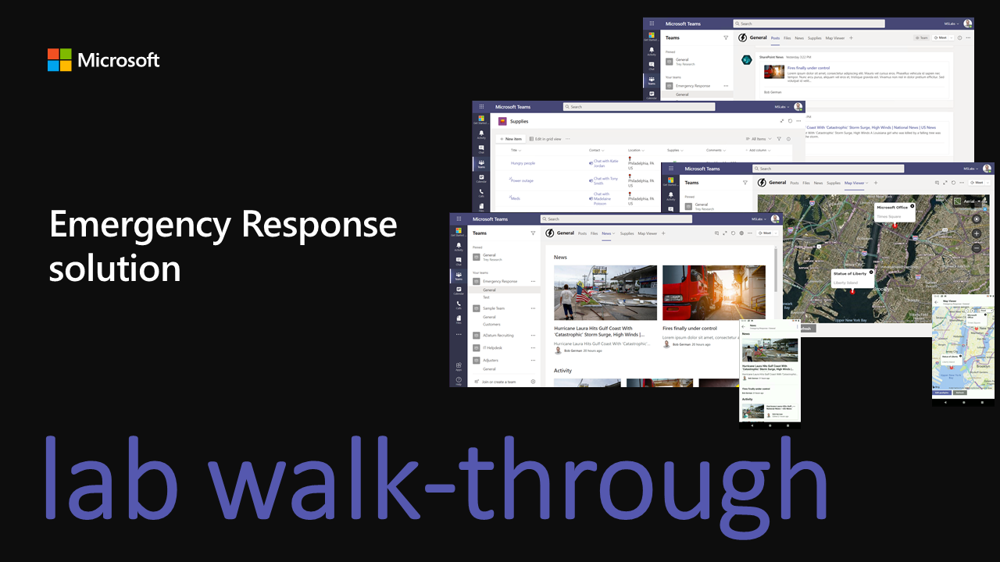

